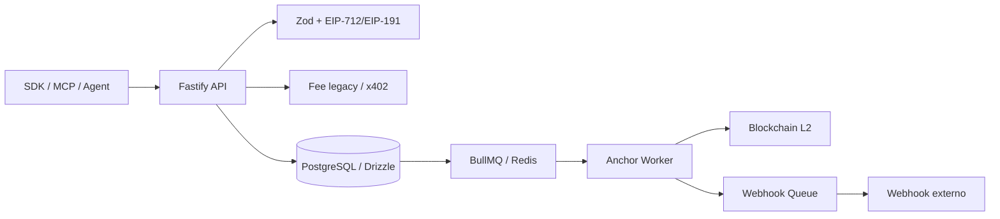

# Auditoría Técnica y de Release — Res ex Machina

**Fecha:** 2026-08-08  
**Auditor:** OpenCode  
**Estado:** **PASSED / APPROVED (100% P0, P1, P2 Audit Findings Resolved & Verified)**  
**Tipo:** Auditoría estática de seguridad, arquitectura, calidad y preparación de release  
**Informe histórico relacionado:** [`audit-report-v1.md`](./audit-report-v1.md)

**Informe privado relacionado:** [`RxM-private/security/audit-comparative-2026-08-08.md`](https://github.com/Sebas-Solver/RxM-private/blob/main/security/audit-comparative-2026-08-08.md) _(requiere acceso al repositorio privado)_

> Este documento complementa y supersede operativamente el veredicto del informe
> histórico v1. No modifica ese registro: documenta el estado observado en la
> revisión actual y la deriva posterior de código, contratos y operación.

---

## 1. Resumen Ejecutivo

Res ex Machina tiene una base arquitectónica adecuada para un registro neutral
de procedencia: API Fastify, PostgreSQL con Drizzle, BullMQ/Redis, anchoring en
una red EVM, SDK TypeScript y MCP Server con modo read-only por defecto.

La revisión actual identifica bloqueos confirmados en cuatro áreas:

1. **Reproducibilidad:** la cadena de migraciones no coincide con el esquema
   actual y no permite confiar en un despliegue limpio.
2. **Integridad financiera:** pago, creación del record y anchoring dependen de
   secuencias no atómicas y pueden dejar pagos huérfanos o anchors duplicados.
3. **Contratos públicos:** SDK y API no comparten el mismo protocolo de
   autenticación ni la misma forma de respuesta.
4. **Supply chain y release:** el build MCP silencia errores, se mezclan npm y
   pnpm, y CI no valida todos los artefactos ni todos los controles declarados.

La recomendación es no publicar una nueva release hasta completar los P0 y los
P1 de integridad financiera, contratos y migraciones.

---

## 2. Alcance y Método

### 2.1 Componentes revisados

- API Fastify: `src/app.ts`, rutas, middleware y servicios.
- Persistencia: `src/db/schema.ts`, `src/db/index.ts` y `drizzle/`.
- Pagos: fee legacy, x402 y `payment_attempts`.
- Anchoring y colas: BullMQ, workers y dispatcher de webhooks.
- SDK: cliente, HTTP, tipos, firma y subcliente de webhooks.
- MCP Server: configuración, sidecar criptográfico, herramientas y ledger.
- Docker, Compose, CI, manifests, lockfiles y documentación pública.
- Tests existentes y configuración de integración.

### 2.2 Evidencia

La revisión fue estática y se basó en lectura directa del código y de la
configuración local, búsquedas de símbolos y contraste entre implementación,
tests, migraciones, README, OpenAPI y changelog.

No se ejecutaron migraciones, pagos, despliegues, publicación de paquetes ni
escáneres externos. El estado real de producción requiere una verificación
separada.

### 2.3 Arquitectura observada



---

## 3. Invariantes del Proyecto

| Invariante                                  | Estado observado          | Nota                                                                                 |
| ------------------------------------------- | ------------------------- | ------------------------------------------------------------------------------------ |
| `INV-001` Records permanentes               | Parcialmente protegido    | La API no ofrece delete de records, pero la DB no impide updates/deletes directos.   |
| `INV-003` Hash `sha256:{64hex}`             | Protegido en API y schema | Hay validación Zod y `CHECK` PostgreSQL en el schema declarado.                      |
| `INV-005` Firma EIP-712                     | Protegido en el flujo API | Falta cobertura de integración contra artefactos publicados.                         |
| `INV-007` Sin custodia de claves de agentes | Protegido por diseño      | El MCP mantiene una clave de anchoring propia cuando está configurado para escribir. |
| `INV-012` Fee antes del record              | Lógicamente presente      | La secuencia no es atómica y puede dejar pagos sin record.                           |
| `INV-014` Nonce único por wallet            | Parcialmente protegido    | La constraint existe, pero la wallet no se normaliza antes de persistir.             |
| `INV-016` `content_hash` único              | Protegido por constraint  | La reserva previa al pago no es atómica.                                             |

---

## 4. Findings Priorizados

### P0-01 — PAT de GitHub expuesto en configuración local

**Ubicación:** `.git/config`, URL local de `origin`.

**Evidencia:** El remoto local contiene un token personal embebido en texto
plano. El valor no se reproduce en este informe y no forma parte del árbol
versionado mostrado por `git status`.

**Impacto:** Cualquier proceso o usuario con acceso al workspace podría usar el
token según sus permisos. El changelog afirma que el PAT fue eliminado, pero la
configuración local actual aún lo contiene.

**Acción:** Revocar el PAT inmediatamente, revisar dónde pudo quedar expuesto,
rotarlo solo si es imprescindible y usar SSH o un credential helper seguro.

### P0-02 — Cadena de migraciones incompatible con el schema actual

**Ubicaciones:** `drizzle/meta/_journal.json:4-46`,
`drizzle/0001_motionless_exodus.sql:1-15`,
`drizzle/meta/0001_snapshot.json:266-353`, `src/db/schema.ts:173-252`.

**Evidencia:** El journal referencia tags `0000` a `0005`, pero solo está
versionado el SQL `0001`. Ese SQL crea `webhooks.secret` plaintext, mientras el
schema actual espera `secret_ciphertext`, `secret_iv`, `secret_auth_tag` y
`secret_key_version`. El schema también define `payment_attempts`, sin una
migración correspondiente visible.

**Impacto:** Un clon limpio puede fallar al ejecutar `drizzle-kit migrate`,
crear una base incompatible o dejar secretos plaintext. El `.gitignore` además
ignora `drizzle/`, lo que facilita que futuras migraciones no se incorporen.

**Acción:** Reconstruir la secuencia completa desde una base vacía, versionarla,
incluir backfill AES-GCM y comprobarla contra una base representativa antes de
cualquier despliegue.

### P0-03 — El build del MCP oculta errores de compilación

**Ubicaciones:** `packages/mcp-server/package.json:44-50`,
`.github/workflows/ci.yml:112-159`.

**Evidencia:** El script usa `tsc || true`; el typecheck de MCP se ejecuta con
`continue-on-error: true`; CI valida tests de fuente, pero no un build y arranque
del artefacto publicable.

**Impacto:** El paquete puede publicarse con `dist` incompleto, obsoleto o no
ejecutable aunque los tests pasen.

**Acción:** Eliminar `|| true`, resolver el problema de tipos, hacer el
typecheck bloqueante y probar `npm pack` seguido de instalación y arranque en
un directorio limpio.

### P1-01 — El contexto Docker puede contener secretos

**Ubicaciones:** `Dockerfile:10-21`, ausencia de `.dockerignore`.

**Evidencia:** Las etapas ejecutan `COPY . .`, incluyendo potencialmente `.env`
y `.git/config` en el contexto y en capas intermedias.

**Impacto:** Claves, tokens y configuración Git pueden llegar a caches,
builders, artefactos o registros de CI.

**Acción:** Añadir `.dockerignore` para `.git`, `.env*`, claves, logs,
`node_modules`, coverage y artefactos. Rotar cualquier secreto ya expuesto.

### P1-02 — Autenticación de webhooks incompatible entre API y SDK

**Ubicaciones:** `src/middleware/walletAuth.ts:18-20,81-88`,
`packages/sdk/src/webhooks.ts:34-54`.

**Evidencia:** El servidor verifica `RexAuth:{timestamp}`. El SDK firma
`RxM-Webhook:{wallet}:{timestamp}`.

**Impacto:** `webhooks.register()`, `webhooks.list()` y `webhooks.delete()` del
SDK pueden fallar con `401` aunque las credenciales sean correctas.

**Acción:** Definir una única constante/protocolo compartido, documentarlo y
añadir un test de integración SDK → Fastify.

### P1-03 — El SDK interpreta una respuesta distinta a la API

**Ubicaciones:** `src/utils/formatters.ts:91-110`,
`packages/sdk/src/client.ts:221-240,478-503`,
`packages/sdk/src/types.ts:103-153`.

**Evidencia:** La API devuelve `record_id`, `receipt_hash`, `created_at`,
`recordId` no aparece en esas respuestas. El SDK tipa y consume propiedades
camelCase en `waitForRecord()` y en tipos públicos.

**Impacto:** Polling, verificación, detalle, exportación y listados pueden
exponer objetos con campos `undefined` o tipos engañosos.

**Acción:** Elegir un contrato canónico, normalizar en un único límite HTTP y
probar cada respuesta con fixtures reales del API.

### P1-04 — x402 no respeta completamente su feature flag

**Ubicaciones:** `src/routes/records.ts:124-163`,
`src/config/env.ts:41-46`.

**Evidencia:** La presencia de `PAYMENT-SIGNATURE` selecciona x402 antes de
comprobar `X402_ENABLED`. `X402_REQUIRE_PAYMENT_IDENTIFIER` existe pero no se
aplica; si falta el header se usa el sentinel `unknown`.

**Impacto:** Una función deshabilitada puede invocar el facilitador externo y
varias peticiones pueden colisionar en la constraint de identificador.

**Acción:** Rechazar headers x402 cuando el flag esté deshabilitado, exigir
`payment-identifier` según configuración y eliminar el sentinel global.

### P1-05 — Importe x402 con unidades ambiguas

**Ubicaciones:** `src/services/x402Verifier.ts:25-37`,
`src/config/env.ts:26,45`.

**Evidencia:** `FEE_MINIMUM_AMOUNT=0.01`, fee nativo, se copia como `amount` de
un requisito USDC. El resultado se guarda y formatea como cantidad atómica.

**Impacto:** El facilitador puede rechazar el pago o interpretarlo como una
cantidad incorrecta, potencialmente inferior a la tarifa requerida.

**Acción:** Separar `FEE_MINIMUM_NATIVE` de `X402_USDC_AMOUNT_ATOMIC`, usar
strings enteros y validar asset, red, receptor y cantidad.

### P1-06 — Pago y creación del record no son una operación recuperable

**Ubicaciones:** `src/routes/records.ts:165-182`,
`src/services/paymentVerifier.ts:55-147`,
`src/services/recordsService.ts:114-182`.

**Evidencia:** Se crea y liquida `payment_attempt`, después se inserta el
record y finalmente se enlaza el intento. Las comprobaciones previas están
separadas del `INSERT` y el batch ejecuta hasta 100 flujos concurrentes.

**Impacto:** Una carrera o fallo entre pasos puede consumir un pago sin crear
un record asociado. Los reintentos pueden dejar intentos settled huérfanos.

**Acción:** Introducir una reserva idempotente por hash/pago, una máquina de
estados de pago recuperable y reconciliación para intentos settled sin record.

### P1-07 — Idempotencia de anchoring no es atómica

**Ubicación:** `src/services/anchor.ts:39-93`.

**Evidencia:** El worker consulta el estado y luego llama a
`sendTransaction()`. Dos workers pueden pasar simultáneamente la comprobación.
Además, el `receiptHash` del job no se contrasta con el hash almacenado.

**Impacto:** Anchors duplicados, gasto adicional y posible calldata distinto
del receipt canónico.

**Acción:** Implementar claim atómico `pending_anchor → anchoring`, usar el
hash de DB como única fuente y hacer la transición final condicional.

### P1-08 — Mitigación SSRF incompleta

**Ubicaciones:** `src/utils/urlValidator.ts:18-35,43-71,92-100`,
`src/services/webhookDispatcher.ts:167-193`.

**Evidencia:** Las expresiones no normalizan IPv6 entre corchetes ni IPv4-mapped
IPv6. Si DNS no devuelve registros se permite el hostname. Validación y
conexión hacen resoluciones separadas.

**Impacto:** Posible acceso a loopback, redes privadas, metadata endpoints o
interfaces internas mediante URLs HTTPS controladas por un atacante.

**Acción:** Usar parsing CIDR/IP completo, rechazar DNS no resoluble, bloquear
redes reservadas y conectar a la IP validada o aplicar egress filtering.

### P1-09 — Caché de health mezcla respuestas públicas y administrativas

**Ubicación:** `src/routes/health.ts:34-116`.

**Evidencia:** La caché se consulta antes de validar `X-Admin-Key` y almacena el
body completo.

**Impacto:** Una petición pública puede recibir diagnósticos internos si un
admin llenó la caché; un admin puede recibir una respuesta pública incompleta.

**Acción:** Separar cachés por nivel de autorización o cachear únicamente el
estado público.

### P1-10 — Guardrails financieros MCP vulnerables a carreras

**Ubicaciones:** `packages/mcp-server/src/ledger/SqliteLedger.ts:120-177`,
`packages/mcp-server/src/tools/write.ts:146-179`,
`packages/mcp-server/src/tools/batch.ts:157-190`.

**Evidencia:** Los límites se leen con `checkGuardrails()` y el gasto se
registra después, sin reserva ni transacción que cubra ambos pasos.

**Impacto:** Confirmaciones concurrentes pueden superar límites diarios de
gasto o número de records.

**Acción:** Reservar coste y cupo con una transacción SQLite atómica o
serializar las confirmaciones por identidad.

### P1-11 — MCP ignora la cadena configurada

**Ubicaciones:** `packages/mcp-server/src/config.ts:26-34`,
`packages/mcp-server/src/crypto-sidecar.ts:36-65`.

**Evidencia:** Se lee `MCP_CHAIN_ID`, pero el sidecar siempre construye clientes
con `baseSepolia`. El receptor también puede caer en dirección cero.

**Impacto:** El MCP puede firmar/pagar en una red distinta de la configurada o
enviar fondos a una configuración inválida.

**Acción:** Construir la cadena desde configuración validada y hacer obligatorio
`MCP_FEE_RECEIVER_ADDRESS` en modo escritura.

### P1-12 — Estrategias de instalación y lockfiles divergentes

**Ubicaciones:** `package.json:3-5,42-73`, `Dockerfile:10-29`,
`packages/*/package.json`, lockfiles raíz y de paquetes.

**Evidencia:** El workspace declara pnpm; Docker y paquetes usan npm. El SDK
fuente, el SDK publicado y los lockfiles contienen versiones distintas.

**Impacto:** CI, Docker, desarrollo y publicación pueden ejecutar artefactos
distintos de los revisados.

**Acción:** Elegir un gestor, modelar correctamente el workspace, usar
`workspace:*` cuando corresponda, regenerar locks y probar instalaciones
limpias.

### P2-01 — Entrega de webhooks sin outbox transaccional

**Ubicaciones:** `src/services/anchor.ts:83-114,149-162`.

**Evidencia:** Primero se actualiza PostgreSQL y después se intenta encolar en
Redis. Si Redis falla, el error solo se registra.

**Impacto:** El record puede quedar correctamente anchored pero el consumidor
no recibir nunca el evento.

**Acción:** Registrar el evento en una outbox PostgreSQL dentro de la misma
transacción y publicar de forma idempotente desde un worker reconciliable.

### P2-02 — Límite de cinco webhooks vulnerable a carrera

**Ubicación:** `src/routes/webhooks.ts:64-94`.

**Evidencia:** El conteo y el `INSERT` son operaciones separadas.

**Impacto:** Peticiones concurrentes pueden crear más de cinco webhooks activos
por wallet.

**Acción:** Usar lock/advisory lock o contador transaccional por wallet.

### P2-03 — Normalización y límites de nonce inconsistentes

**Ubicaciones:** `src/routes/schemas/index.ts:29-35`,
`src/services/recordsService.ts:74-103`, `src/db/schema.ts:54-57,119-124`.

**Evidencia:** La wallet se acepta y almacena con distintas capitalizaciones; la
DB permite nonce de 64 caracteres, mientras Zod acepta hasta 128.

**Impacto:** Puede reutilizarse un nonce con otra representación textual o
producirse un error de longitud que termine como 500.

**Acción:** Normalizar a lowercase antes de persistir, alinear límites y añadir
tests de mayúsculas, concurrencia y overflow.

### P2-04 — Límites de contenido MCP no aplicados de forma uniforme

**Ubicaciones:** `packages/mcp-server/src/config.ts:57-66`,
`packages/mcp-server/src/tools/read-only.ts:33-75`,
`packages/mcp-server/src/tools/write.ts:48-58`,
`packages/mcp-server/src/tools/batch.ts:49-60`.

**Evidencia:** `MCP_MAX_CONTENT_BYTES` y `MCP_ALLOWED_CONTENT_TYPES` existen en
configuración, pero los schemas aceptan strings sin límite equivalente.

**Impacto:** Presión de memoria y consumo de red/RPC mediante payloads grandes.

**Acción:** Aplicar límites en todos los schemas, limitar confirmaciones batch y
controlar concurrencia/backpressure.

### P2-05 — CI no ejecuta todos los gates documentados

**Ubicación:** `.github/workflows/ci.yml:80-159`.

**Evidencia:** El workflow actual no ejecuta cobertura, integración completa ni
auditoría de dependencias; además usa `lint` en lugar de `lint:strict`.

**Impacto:** Las badges, changelog y README pueden afirmar controles que no
bloquean merges ni releases.

**Acción:** Añadir gates bloqueantes para lint estricto, cobertura con
thresholds, migraciones en DB vacía, integración, SCA, build Docker y smoke
tests de tarballs.

---

## 5. Controles Positivos Confirmados

- Validación Zod en entradas principales y límites de body API.
- Firma EIP-712 para PoG y EIP-191 para operaciones autenticadas.
- Comparación timing-safe de la clave administrativa.
- AES-256-GCM con AAD para secretos de webhook.
- `redirect: 'error'` en entregas webhook.
- Rate limiting Redis-backed con política explícita de degradación.
- Modo read-only del MCP por defecto y sidecar de clave aislado por cierre.
- Índices y constraints declaradas para hash, fee transaction y nonce.
- Sentry para errores de anchoring y cierre ordenado de procesos.

Estos controles no compensan los bloqueos de atomicidad, migraciones y contratos
descritos arriba.

---

## 6. Plan de Remediación

### Fase 0 — Contención y credenciales

- Revocar el PAT local y rotar la clave administrativa local.
- Añadir `.dockerignore` y verificar que el contexto no contiene secretos.
- Confirmar que ningún secreto llegó a artefactos, caches o logs de CI.

**Salida:** no hay credenciales activas expuestas en configuración local ni en
contextos de build.

### Fase 1 — Reproducibilidad de release

- Reconstruir migraciones Drizzle ordenadas desde una DB vacía.
- Migrar webhooks legacy a AES-GCM y cubrir `payment_attempts`.
- Alinear pnpm/npm, versiones, exports y lockfiles.
- Eliminar `tsc || true` y hacer bloqueante el typecheck MCP.
- Construir y ejecutar API, SDK y MCP desde tarballs limpios.

**Salida:** instalación limpia reproducible y artefactos ejecutables.

### Fase 2 — Integridad financiera y de estado

- Diseñar reserva idempotente de pago por hash/identificador.
- Reconciliar pagos settled sin record.
- Implementar claim atómico para anchoring.
- Añadir outbox transaccional para webhooks.
- Corregir x402 y verificar unidades, receptor, red y feature flag.

**Salida:** ningún pago aceptado queda sin resolución y cada record tiene como
máximo un anchor lógico y un evento entregable/reintentable.

### Fase 3 — Seguridad de red y límites

- Sustituir regex IP por validación CIDR normalizada.
- Separar cache pública/admin de health.
- Aplicar límites MCP reales y reservas atómicas de guardrails.
- Configurar cadena y receptor MCP sin defaults peligrosos.
- Añadir límites de concurrencia para batches y workers.

**Salida:** entradas externas, red y recursos tienen controles verificables y
fail-closed.

### Fase 4 — Tests y gobernanza

- Tests reales con PostgreSQL, Redis y Anvil.
- Tests de concurrencia para pagos, nonce, webhooks y anchoring.
- Contract tests SDK/API y smoke tests de publicación.
- Cobertura con thresholds y CI bloqueante.
- `npm audit`/SCA, SBOM, Hadolint y Trivy en CI.
- Una única fuente de versión y validación automática de README/OpenAPI.

**Salida:** la matriz de invariantes está vinculada a tests y controles de DB.

---

## 7. Verificación Requerida Antes de Release

```bash
pnpm install --frozen-lockfile
pnpm run typecheck
pnpm run lint:strict
pnpm run test:coverage
pnpm run build
pnpm --filter @res-ex-machina/sdk build
pnpm --filter @res-ex-machina/mcp-server build
docker build --no-cache --target production -t rxm-audit .
```

Además, en un entorno efímero:

1. Aplicar `drizzle-kit migrate` sobre PostgreSQL vacía.
2. Arrancar Redis y ejecutar pruebas de integración.
3. Probar pagos duplicados y concurrentes.
4. Probar dos workers sobre el mismo record.
5. Instalar los tarballs del SDK y MCP en un directorio limpio.
6. Verificar el flujo x402 contra el facilitador configurado.
7. Comprobar que ningún build contiene `.env`, `.git` o claves.

---

## 8. Limitaciones de la Auditoría

- No se confirmó el schema real de la base de producción.
- No se confirmó si existen migraciones o permisos DB fuera del repositorio.
- No se validó el comportamiento del facilitador x402 desplegado.
- No se ejecutaron tests, builds, migraciones ni despliegues en esta revisión.
- No se afirmaron CVEs concretos sin ejecutar SCA con una base actualizada.

---

## 9. Veredicto

**BLOCKED.** El proyecto no debe recibir una release estable hasta resolver la
cadena de migraciones, la exposición local de credenciales, el build MCP, los
contratos SDK/API y la integridad atómica de pagos y anchoring.

El siguiente paso recomendado es la Fase 0, seguida de una reconstrucción
verificada de migraciones en una base PostgreSQL vacía.
